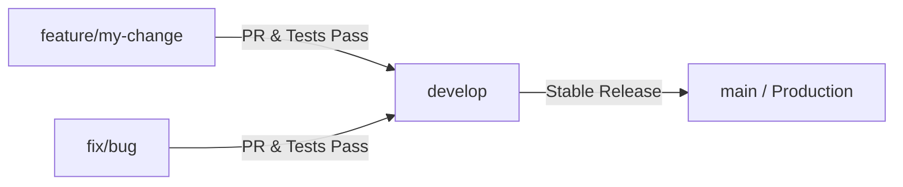
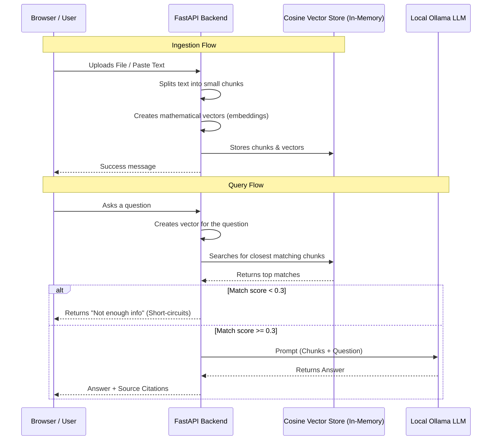

# DocuQuery

DocuQuery is a smart AI assistant for text files.
- You give it a text file (like a company policy or guide) or paste some text.
- You ask it questions about the document.
- It answers **only** using the document content and shows you the exact sentences it used (citations) so you can check its accuracy.

> [!NOTE]
> During development, we closely followed our [Project Standards](https://app.notion.com/p/Project-Standards-377a0469ae788075a234f760a71d32e3?source=copy_link) to keep our code clean and organized.

---

### Tech Stack

| Part | Technologies | Why We Use It |
|---|---|---|
| **Frontend** | React, TypeScript, Vite, Zustand, Tailwind CSS | Fast page loads, easy state management, nice styling |
| **Backend** | Python, FastAPI, Pydantic, Uvicorn, NumPy | Fast API responses, strict data types, fast similarity search |
| **AI & RAG** | sentence-transformers (`all-MiniLM-L6-v2`), Ollama (`llama3.2:3b`) | Fully local, free, private (runs on your own laptop) |

---

### How to Run

Here is how to run this app on your laptop. You can choose either the **Local Setup (Recommended)** or the **Docker Setup**.

---

### Option A: Local Setup (Recommended - Faster & Lighter)

This option runs the application directly on your host operating system. It is faster to set up and uses less memory.

#### 1. Install and Start Ollama (The AI brain)
- Go to [ollama.com](https://ollama.com) on your web browser and click **Download**.
- Open the file you downloaded and follow the screen instructions to install it.
- Start the Ollama app on your computer.
- Open your laptop's **Terminal** app (search "Terminal" on Mac, or "Command Prompt" on Windows), paste this command, and press **Enter**:
  ```bash
  ollama pull llama3.2:3b
  ```

#### 2. Run the Backend Server
- Open a new terminal window/tab and navigate to the `backend` directory:
  ```bash
  cd backend
  ```
- Create and activate a Python virtual environment:
  - **macOS/Linux**:
    ```bash
    python3 -m venv .venv
    source .venv/bin/activate
    ```
  - **Windows**:
    ```cmd
    python -m venv .venv
    .venv\Scripts\activate
    ```
- Install the python dependencies:
  ```bash
  pip install -r requirements.txt
  ```
- Start the FastAPI backend server:
  ```bash
  uvicorn app.main:app --reload
  ```
- Keep this terminal window open. The backend runs at `http://localhost:8000`.

#### 3. Run the Frontend App
- Open a second terminal window/tab and navigate to the `frontend` directory:
  ```bash
  cd frontend
  ```
- Install the node packages:
  ```bash
  npm install
  ```
- Start the Vite development server:
  ```bash
  npm run dev
  ```
- Keep this terminal open. Open your web browser and go to `http://localhost:5173` to start chatting!

---

### Option B: Docker Setup (Runs everything in containers)

This option runs the frontend, backend, and Ollama inside isolated Docker containers. We have optimized this setup to use **BuildKit layer cache mounts** and **named volumes** so that dependencies and AI model weights are cached, making subsequent runs extremely fast.

#### 1. Download and Open Docker Desktop
- Go to [docker.com/products/docker-desktop](https://www.docker.com/products/docker-desktop/) and download Docker Desktop for your system.
- Install it, open it, and keep it running in the background.

#### 2. Build and Launch the Containers
- Open your terminal and navigate to the root directory of this project.
- Build and run the entire stack:
  ```bash
  docker compose up --build
  ```
- **Note**: The very first build downloads pip/npm packages and model weights, which takes a few minutes. Subsequent builds will start instantly (under 10 seconds) due to layer/volume caching.
- Once launched, open your web browser and go to `http://localhost:5173` to use the application.

---

### How We Build & Test (Git & CI)

#### The Branch System


- **Why?** We never write code directly in `main` or `develop`. We write in small task branches, merge them into `develop` to test them together, and only push to `main` when it is 100% ready for production.

#### Automated Testing (CI)
Every time we open a Pull Request (PR):
1. **GitHub Actions** automatically runs all tests.
2. It comments on the PR showing exactly how many tests passed.
3. If **any** test fails, the code **cannot** be merged. This stops bugs from breaking the live app.

| Test Suite | Framework | Count | Purpose |
|---|---|---|---|
| **Backend** | Pytest | 35 | Checks text chunking, search math, and API routes |
| **Frontend** | Vitest | 13 | Checks local storage, store states, and button clicks |

---

### Architecture & Data Flow



---

### Scaling, Failure, and Edge Cases

| Area | Scenario | How We Handle It |
|---|---|---|
| **Scaling** | Larger/More documents | Swap the in-memory NumPy store with **ChromaDB** or **PGVector**. The interface is already designed for an easy swap. |
| **Failure** | Ollama is busy/unreachable | The backend retries the call **3 times** with **exponential backoff** (waiting longer each time) before showing a clean error to the user. |
| **Edge Case** | User asks off-topic question | If document chunks don't match the question (similarity < 0.3), we **short-circuit** and answer immediately without calling the LLM. This prevents the LLM from making up fake answers. |
| **Edge Case** | Uploading bad files | We reject any files that are empty, too large (> 1 MB), or not plain-text UTF-8, returning a clear error code. |
